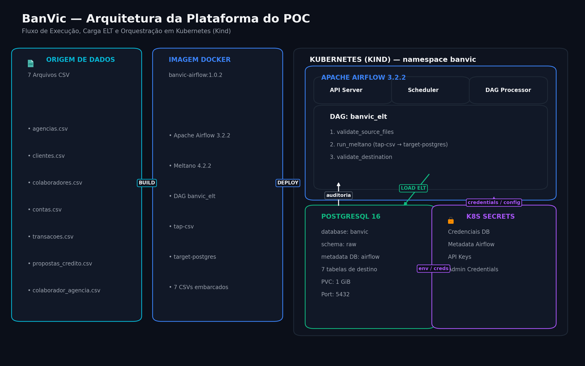
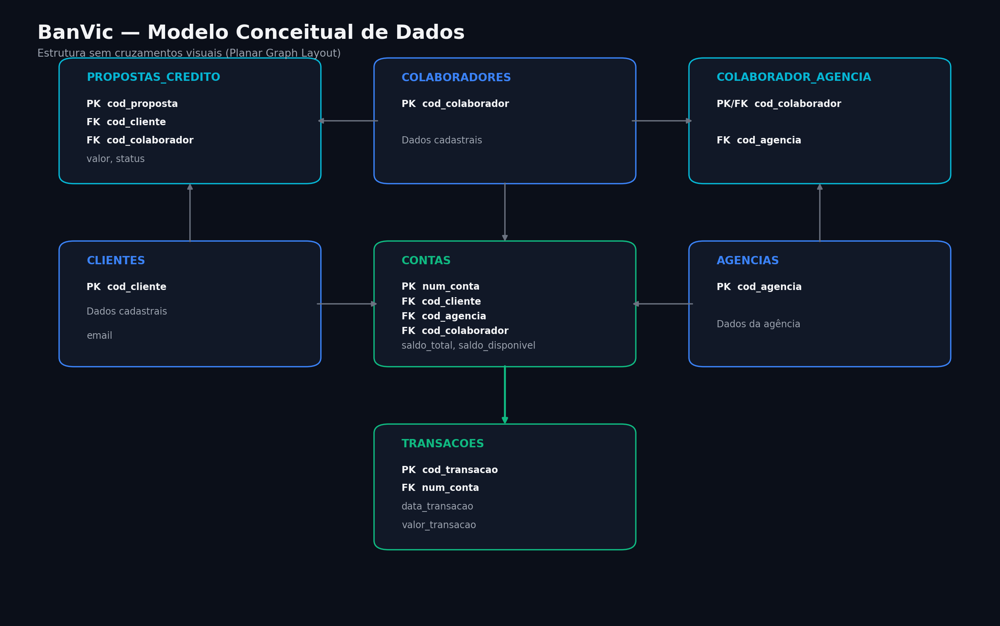

# BanVic Data Engineering POC

Proof of Concept de Engenharia de Dados para ingestão, orquestração e validação dos dados de um ERP bancário fictício (BanVic).

O projeto implementa uma pipeline ELT executada em Kubernetes/Kind, com Apache Airflow para orquestração, Meltano para ingestão dos arquivos CSV e PostgreSQL como camada de destino (`raw`).

## 1. Visão geral

O objetivo deste POC é demonstrar uma infraestrutura reprodutível e uma pipeline de dados simples, modular e observável, cobrindo:

- provisionamento de infraestrutura com Kubernetes/Kind e Helm;
- execução do Apache Airflow em Kubernetes;
- ingestão dos arquivos CSV usando Meltano;
- carga dos dados em PostgreSQL na camada `raw`;
- validação dos arquivos de origem antes da ingestão;
- validação da quantidade de registros após a carga;
- retries e timeout nas etapas da DAG;
- comportamento idempotente para uma carga full snapshot;
- armazenamento de credenciais em Kubernetes Secrets;
- scripts de bootstrap e verificação do ambiente.

## 2. Arquitetura



### Fluxo da pipeline

```text
7 arquivos CSV
        │
        ▼
Imagem Docker
        │
        ▼
Kind / Kubernetes
        │
        ▼
Apache Airflow
        │
        ▼
DAG banvic_elt
        │
        ├── validate_source_files
        │
        ├── run_meltano
        │       │
        │       ├── tap-csv
        │       │
        │       └── target-postgres
        │               │
        │               ▼
        │        PostgreSQL / raw
        │
        └── validate_destination
```

A imagem customizada do Airflow contém os DAGs, o projeto Meltano, as configurações necessárias e os sete arquivos CSV utilizados no POC.

## 3. Tecnologias

| Tecnologia | Uso |
|---|---|
| Docker | Construção da imagem customizada do Airflow |
| Kind | Cluster Kubernetes local |
| Kubernetes | Execução e gerenciamento dos componentes |
| Helm | Instalação e atualização do Airflow |
| Apache Airflow 3.2.2 | Orquestração da pipeline |
| Meltano 4.2.2 | Extração e carregamento dos CSVs |
| tap-csv | Extractor dos arquivos CSV |
| target-postgres | Loader para PostgreSQL |
| PostgreSQL 16 | Armazenamento dos dados |
| Python | Implementação da DAG e validações |
| PowerShell | Automação do bootstrap e verificação no Windows |

### Versões principais

- Airflow: `3.2.2`
- Helm chart Apache Airflow: `1.22.0`
- Meltano: `4.2.2`
- PostgreSQL: `16.15-alpine3.24`
- Kind node image: `kindest/node:v1.35.8`

## 4. Estrutura do projeto

```text
banvic-data-engineering/
│
├── dags/
│   └── banvic_elt.py
│
├── data/
│   └── raw/
│       ├── agencias.csv
│       ├── clientes.csv
│       ├── colaborador_agencia.csv
│       ├── colaboradores.csv
│       ├── contas.csv
│       ├── propostas_credito.csv
│       └── transacoes.csv
│
├── docs/
│   ├── banvic_arquitetura.png
│   └── banvic_modelo_conceitual.png
│
├── infra/
│   ├── airflow/
│   │   ├── Dockerfile
│   │   ├── requirements.txt
│   │   └── values.yaml
│   │
│   ├── kind/
│   │   └── cluster.yaml
│   │
│   ├── postgres/
│   │   ├── deployment.yaml
│   │   ├── pvc.yaml
│   │   └── service.yaml
│   │
│   └── namespace.yaml
│
├── meltano/
│   ├── config/
│   │   └── csv_files_definition.json
│   ├── meltano.yml
│   └── *_lock.yml
│
├── scripts/
│   ├── bootstrap.ps1
│   └── verify.ps1
│
├── .dockerignore
├── .gitignore
└── README.md
```

## 5. Dados de entrada

O POC utiliza sete arquivos CSV fornecidos pelo desafio:

| Arquivo | Destino | Registros validados |
|---|---|---:|
| `agencias.csv` | `raw.agencias` | 10 |
| `clientes.csv` | `raw.clientes` | 998 |
| `colaborador_agencia.csv` | `raw.colaborador_agencia` | 100 |
| `colaboradores.csv` | `raw.colaboradores` | 100 |
| `contas.csv` | `raw.contas` | 999 |
| `propostas_credito.csv` | `raw.propostas_credito` | 2.000 |
| `transacoes.csv` | `raw.transacoes` | 71.999 |

Os arquivos são armazenados em `data/raw/` e fazem parte da imagem customizada utilizada pelo Airflow.

## 6. Estratégia de ingestão

A ingestão foi implementada como um ELT simples:

```text
CSV
  ↓
tap-csv
  ↓
target-postgres
  ↓
PostgreSQL / raw
```

### Extract

O `tap-csv` lê os sete arquivos definidos em:

```text
meltano/config/csv_files_definition.json
```

A configuração define:

- caminho dos arquivos;
- delimitador `,`;
- encoding UTF-8;
- modo estrito (`strict: true`);
- colunas de metadados.

### Load

O `target-postgres` grava os dados no PostgreSQL usando:

```yaml
default_target_schema: raw
load_method: overwrite
validate_records: true
activate_version: false
```

A estratégia `overwrite` foi escolhida porque o POC trabalha com uma fotografia completa dos arquivos de origem. Cada execução recompõe as tabelas de destino com o snapshot atual.

Isso torna a carga idempotente do ponto de vista do conteúdo: executar novamente o mesmo conjunto de arquivos produz novamente o mesmo estado esperado da camada `raw`.

## 7. Orquestração com Airflow

A DAG principal é:

```text
banvic_elt
```

Arquivo:

```text
dags/banvic_elt.py
```

### Fluxo da DAG

```text
validate_source_files
        │
        ▼
   run_meltano
        │
        ▼
validate_destination
```

### Task 1 — `validate_source_files`

Responsabilidades:

- verificar se os sete arquivos existem;
- ler os CSVs;
- contar os registros;
- gerar os quantitativos esperados para a etapa seguinte.

Configuração de retry:

```text
retries = 2
retry_delay = 1 minuto
```

### Task 2 — `run_meltano`

Responsabilidades:

- validar a existência das variáveis de conexão;
- executar:

```text
meltano run tap-csv target-postgres
```

- interromper a task caso o processo retorne erro.

Configurações relevantes:

```text
retries = 2
retry_delay = 1 minuto
execution_timeout = 15 minutos
```

### Task 3 — `validate_destination`

Responsabilidades:

- verificar se o schema `raw` existe;
- consultar a quantidade de registros de cada tabela;
- comparar o resultado com os quantitativos calculados na origem;
- falhar a task caso exista divergência.

As três etapas são encadeadas diretamente:

```text
validação da origem
        ↓
ingestão
        ↓
validação do destino
```

## 8. Confiabilidade e tratamento de falhas

O POC inclui mecanismos básicos de confiabilidade.

### Retries

As tasks principais possuem até duas novas tentativas:

```text
retries = 2
retry_delay = 1 minuto
```

Isso permite recuperar falhas transitórias sem intervenção manual imediata.

### Timeout

A execução do Meltano possui timeout de 15 minutos:

```text
execution_timeout = 15 minutes
```

### Idempotência

O loader PostgreSQL está configurado com:

```text
load_method: overwrite
```

Como os dados são tratados como snapshot completo, uma nova execução do mesmo pipeline recompõe o estado esperado das tabelas `raw`.

Além disso, a DAG limita a execução concorrente:

```text
max_active_runs = 1
max_active_tasks = 1
```

### Validação de origem

A pipeline não inicia a ingestão sem antes confirmar a presença dos sete arquivos.

### Validação de destino

Ao final da carga, a DAG compara as contagens da origem com as tabelas de destino.

Exemplo:

```text
source transacoes = 71.999
destination transacoes = 71.999
```

Uma divergência faz a task falhar.

## 9. PostgreSQL

O PostgreSQL roda no namespace:

```text
banvic
```

Serviço Kubernetes:

```text
banvic-postgres
```

Porta:

```text
5432
```

O PostgreSQL hospeda:

- database `banvic`, utilizado pela pipeline;
- database `airflow`, utilizado pelos metadados do Airflow.

O banco `banvic` possui o schema:

```text
raw
```

As sete tabelas de destino são:

```text
raw.agencias
raw.clientes
raw.colaborador_agencia
raw.colaboradores
raw.contas
raw.propostas_credito
raw.transacoes
```

A persistência do banco é feita com um PersistentVolumeClaim de 1 GiB.

## 10. Modelo conceitual

O modelo conceitual completo é apresentado abaixo:



As principais entidades são:

```text
CLIENTES
CONTAS
TRANSACOES
PROPOSTAS_CREDITO
COLABORADORES
AGENCIAS
COLABORADOR_AGENCIA
```

### Principais chaves

```text
CLIENTES
  PK: cod_cliente

CONTAS
  PK: num_conta
  FK: cod_cliente
  FK: cod_agencia
  FK: cod_colaborador

TRANSACOES
  PK: cod_transacao
  FK: num_conta

PROPOSTAS_CREDITO
  PK: cod_proposta
  FK: cod_cliente
  FK: cod_colaborador

COLABORADORES
  PK: cod_colaborador

AGENCIAS
  PK: cod_agencia

COLABORADOR_AGENCIA
  PK/FK: cod_colaborador
  FK: cod_agencia
```

Os relacionamentos apresentados no diagrama são derivados das chaves estrangeiras presentes nas entidades.

A camada `raw` foi mantida simples para o objetivo do POC e não depende da criação de constraints relacionais para realizar a ingestão.

## 11. Infraestrutura como código

A infraestrutura é declarada no repositório e pode ser recriada com:

- Kind;
- manifests Kubernetes;
- Helm;
- scripts PowerShell.

### Kind

Configuração:

```text
infra/kind/cluster.yaml
```

O cluster utiliza uma imagem de node Kubernetes fixada:

```text
kindest/node:v1.35.8
```

### Kubernetes

Os recursos principais estão em:

```text
infra/namespace.yaml
infra/postgres/
```

### Airflow

O deploy é feito pelo Helm chart do Apache Airflow usando:

```text
infra/airflow/values.yaml
```

A configuração utiliza:

```text
LocalExecutor
```

e desabilita componentes não necessários para este POC.

O banco de metadados do Airflow utiliza o database:

```text
airflow
```

enquanto os dados da pipeline permanecem no database:

```text
banvic
```

## 12. Secrets e credenciais

Credenciais não são versionadas no Git.

O projeto utiliza Kubernetes Secrets para:

```text
banvic-postgres-secret
airflow-metadata
airflow-api-static-secret
airflow-admin-secret
```

Os Secrets são criados pelo script `bootstrap.ps1` quando ainda não existem.

O `.gitignore` exclui arquivos locais de ambiente e credenciais:

```text
.env
.env.*
*.env
*.key
*.pem
```

O repositório não deve conter senhas, tokens ou chaves privadas.

## 13. Bootstrap do ambiente

O script:

```text
scripts/bootstrap.ps1
```

automatiza o provisionamento.

Ele:

1. valida Docker, kubectl, Kind e Helm;
2. cria o cluster Kind caso necessário;
3. cria o namespace `banvic`;
4. cria ou reutiliza as credenciais do PostgreSQL;
5. aplica PostgreSQL, Service e PVC;
6. cria ou reutiliza o banco de metadados do Airflow;
7. cria ou reutiliza o API secret do Airflow;
8. garante a existência do schema `raw`;
9. cria ou reutiliza a credencial do usuário admin;
10. constrói a imagem customizada do Airflow;
11. carrega a imagem no Kind;
12. configura o repositório Helm;
13. instala ou atualiza o Airflow;
14. cria o usuário admin caso ainda não exista.

### Execução

No PowerShell:

```powershell
powershell -ExecutionPolicy Bypass -File .\scripts\bootstrap.ps1
```

O script foi projetado para ser reutilizável: recursos já existentes são reaproveitados e os Secrets existentes são preservados.

## 14. Verificação do ambiente

O script:

```text
scripts/verify.ps1
```

faz uma validação do ambiente sem modificar a infraestrutura.

Ele verifica:

- pods esperados;
- estado `Ready` dos containers;
- `Airflow parallelism`;
- presença da DAG `banvic_elt`;
- existência do schema `raw`;
- quantidade de registros nas sete tabelas;
- últimas execuções da DAG.

Executar:

```powershell
powershell -ExecutionPolicy Bypass -File .\scripts\verify.ps1
```

Uma execução válida termina com:

```text
=== Resultado ===
Verificação concluída.
```

## 15. Execução da DAG

A DAG utiliza configuração de execução manual:

```text
schedule = None
catchup = False
max_active_runs = 1
max_active_tasks = 1
```

O agendamento manual foi escolhido para o POC, permitindo demonstrar a execução controlada pelo avaliador.

### Acesso ao Airflow

Execute:

```powershell
kubectl port-forward svc/airflow-api-server 8080:8080 --namespace banvic
```

Depois acesse:

```text
http://localhost:8080
```

Usuário:

```text
admin
```

A senha fica armazenada no Kubernetes Secret:

```text
airflow-admin-secret
```

## 16. Consultando os dados

Para acessar o PostgreSQL:

```powershell
kubectl exec -it deploy/banvic-postgres -n banvic -- psql -U banvic -d banvic
```

Exemplo:

```sql
SELECT COUNT(*) FROM raw.transacoes;
```

Resultado esperado no dataset utilizado neste POC:

```text
71999
```

Outra consulta útil:

```sql
SELECT
    'agencias' AS tabela,
    COUNT(*) AS registros
FROM raw.agencias
UNION ALL
SELECT 'clientes', COUNT(*) FROM raw.clientes
UNION ALL
SELECT 'colaborador_agencia', COUNT(*) FROM raw.colaborador_agencia
UNION ALL
SELECT 'colaboradores', COUNT(*) FROM raw.colaboradores
UNION ALL
SELECT 'contas', COUNT(*) FROM raw.contas
UNION ALL
SELECT 'propostas_credito', COUNT(*) FROM raw.propostas_credito
UNION ALL
SELECT 'transacoes', COUNT(*) FROM raw.transacoes
ORDER BY tabela;
```

## 17. Resultado da validação

O ambiente foi validado após a execução do bootstrap e do script de verificação.

### Pods principais

```text
airflow-api-server       Running / Ready
airflow-dag-processor    Running / Ready
airflow-scheduler        Running / Ready
banvic-postgres          Running / Ready
```

### Configuração de paralelismo

```text
Airflow parallelism = 2
```

### Quantidade de registros validada

| Tabela | Registros |
|---|---:|
| `raw.agencias` | 10 |
| `raw.clientes` | 998 |
| `raw.colaborador_agencia` | 100 |
| `raw.colaboradores` | 100 |
| `raw.contas` | 999 |
| `raw.propostas_credito` | 2.000 |
| `raw.transacoes` | 71.999 |

Também foram observadas execuções bem-sucedidas da DAG durante a validação do projeto.

## 18. Observações sobre qualidade dos dados

As validações exploratórias realizadas durante o desenvolvimento encontraram alguns pontos relevantes no dataset:

- existe referência ao cliente `528` em dados transacionais/de crédito, embora esse cliente não esteja presente em `clientes.csv`;
- foram encontrados quatro emails duplicados na base de clientes.

Esses pontos foram preservados no `raw`, em vez de serem descartados ou corrigidos silenciosamente.

A decisão é coerente com a função da camada `raw`: preservar a origem e permitir que regras de qualidade, tratamento e modelagem sejam aplicadas em camadas posteriores.

## 19. Limitações e próximos passos

Este projeto é um POC, portanto algumas decisões foram deliberadamente simplificadas.

Possíveis evoluções:

- adicionar uma camada `staging` com dbt;
- criar modelos analíticos e dimensões/fatos;
- implementar testes de qualidade adicionais;
- adicionar validações de schema e tipos;
- separar metadata database e target database em instâncias independentes;
- utilizar armazenamento externo para arquivos em vez de empacotá-los na imagem;
- implementar carga incremental quando a fonte disponibilizar chave/coluna de alteração confiável;
- utilizar um executor distribuído caso o volume de dados cresça;
- adicionar observabilidade com métricas e dashboards;
- adicionar CI/CD para validação automática dos manifests, DAG e imagem;
- utilizar um Secret Manager externo em ambientes produtivos.

## 20. Reprodução rápida

### Pré-requisitos

```text
Docker Desktop
kubectl
Kind
Helm
PowerShell
```

Clone o repositório:

```powershell
git clone https://github.com/vitorturcisn/banvic-data-engineering.git
cd banvic-data-engineering
```

Execute o bootstrap:

```powershell
powershell -ExecutionPolicy Bypass -File .\scripts\bootstrap.ps1
```

Valide:

```powershell
powershell -ExecutionPolicy Bypass -File .\scripts\verify.ps1
```

Acesse o Airflow:

```powershell
kubectl port-forward svc/airflow-api-server 8080:8080 --namespace banvic
```

Abra:

```text
http://localhost:8080
```

Execute manualmente a DAG `banvic_elt` e acompanhe:

```text
validate_source_files
        ↓
run_meltano
        ↓
validate_destination
```

## 21. Entregáveis principais

Os principais artefatos deste POC são:

```text
dags/banvic_elt.py
infra/
meltano/
data/raw/
docs/
scripts/bootstrap.ps1
scripts/verify.ps1
README.md
```

## 22. Repositório

GitHub:

https://github.com/vitorturcisn/banvic-data-engineering
