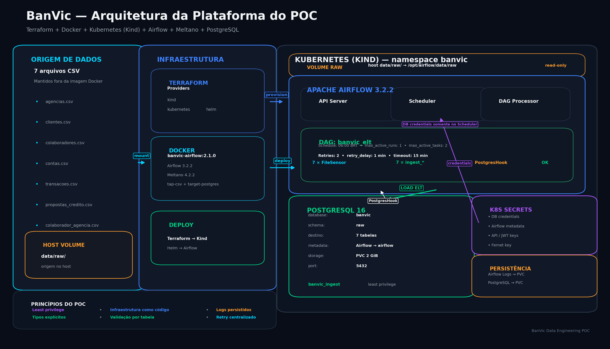
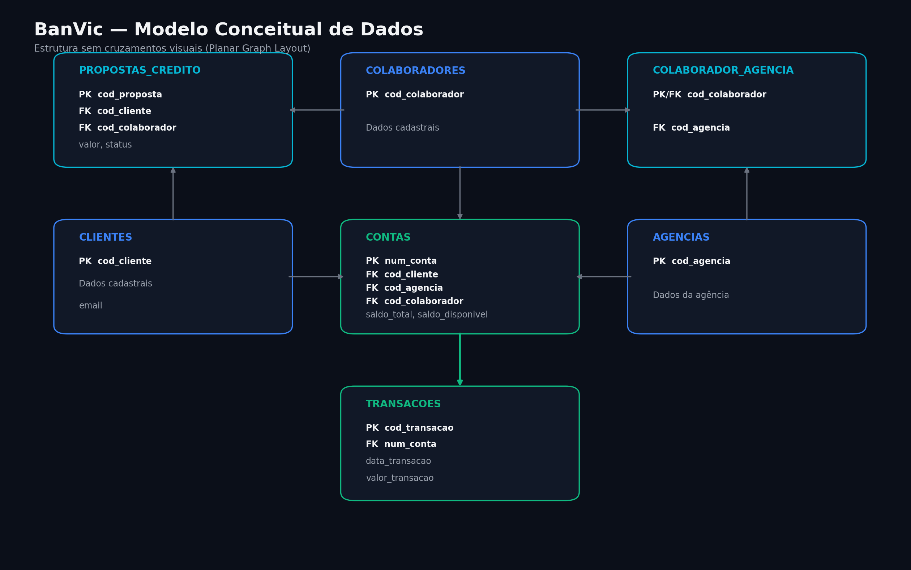

# BanVic Data Engineering POC

Proof of Concept de Engenharia de Dados para ingestão, orquestração e validação dos dados de um ERP bancário fictício (BanVic).

O projeto implementa uma pipeline ELT executada em Kubernetes/Kind, com Apache Airflow para orquestração, Meltano para ingestão dos arquivos CSV e PostgreSQL como camada de destino (`raw`).

A infraestrutura é declarada com Terraform, enquanto Helm é utilizado pelo Terraform para instalar o Apache Airflow.

---

## 1. Visão geral

O objetivo deste POC é demonstrar uma solução reprodutível de Engenharia de Dados, cobrindo:

- provisionamento de um cluster Kubernetes local com Kind;
- provisionamento da plataforma com Terraform;
- execução do Apache Airflow em Kubernetes;
- ingestão dos arquivos CSV usando Meltano;
- carga dos dados em PostgreSQL na camada `raw`;
- validação da existência dos arquivos antes da ingestão;
- validação da quantidade de registros após a carga;
- retries e timeout nas tarefas de ingestão;
- controle de concorrência da DAG;
- carga idempotente utilizando snapshot completo;
- armazenamento de credenciais em Kubernetes Secrets;
- persistência dos dados do PostgreSQL;
- persistência dos logs do Airflow;
- scripts PowerShell para bootstrap e verificação do ambiente.

---

## 2. Arquitetura



### Fluxo da plataforma

```text
                       Terraform
                           │
          ┌────────────────┴────────────────┐
          │                                 │
          ▼                                 ▼
      Kind Cluster                    Platform Kubernetes
                                          │
                           ┌──────────────┼──────────────┐
                           │              │              │
                           ▼              ▼              ▼
                        Airflow       PostgreSQL       PVCs
                           │              │
                           │              └── raw
                           │
                           ▼
                     DAG banvic_elt
                           │
          ┌────────────────┼─────────────────┐
          │                │                 │
          ▼                ▼                 ▼
   FileSensor #1 ... FileSensor #7     ...
          │                │
          ▼                ▼
   ingest_table #1 ... ingest_table #7
          │
          └────────────────┬────────────────┘
                           ▼
                  summarize_ingestion
```

---

## 3. Tecnologias

| Tecnologia | Uso |
|---|---|
| Docker | Construção da imagem customizada do Airflow |
| Kind | Cluster Kubernetes local |
| Kubernetes | Execução e gerenciamento dos componentes |
| Terraform | Provisionamento da infraestrutura |
| Helm | Instalação do Apache Airflow |
| Apache Airflow 3.2.2 | Orquestração da pipeline |
| Meltano 4.2.2 | Extração e carregamento dos CSVs |
| tap-csv | Extractor dos arquivos CSV |
| target-postgres | Loader para PostgreSQL |
| PostgreSQL 16.15 | Armazenamento dos dados |
| Python | Implementação da DAG e validações |
| PowerShell | Automação do bootstrap e verificação |

### Versões principais

```text
Terraform: >= 1.6.0
Airflow: 3.2.2
Apache Airflow Helm Chart: 1.22.0
Meltano: 4.2.2
PostgreSQL: 16.15-alpine3.24
Kind node image: kindest/node:v1.35.8
Terraform provider kind: 0.11.0
Terraform provider kubernetes: 3.2.1
Terraform provider helm: 3.3.0
Terraform provider random: 3.9.0
```

---

## 4. Estrutura do projeto

```text
banvic-data-engineering/
│
├── dags/
│   └── banvic_elt.py
│
├── data/
│   └── raw/
│       ├── agencias.csv
│       ├── clientes.csv
│       ├── colaborador_agencia.csv
│       ├── colaboradores.csv
│       ├── contas.csv
│       ├── propostas_credito.csv
│       └── transacoes.csv
│
├── docs/
│   ├── banvic_arquitetura.png
│   └── banvic_modelo_conceitual.png
│
├── airflow/
│   ├── Dockerfile
│   ├── requirements.txt
│   └── values.yaml
│
├── kind/
│   └── cluster.yaml
│
├── meltano/
│   ├── config/
│   │   └── csv_files_definition.json
│   ├── meltano.yml
│   └── *_lock.yml
│
├── terraform/
│   ├── cluster/
│   │   ├── .terraform.lock.hcl
│   │   ├── main.tf
│   │   ├── outputs.tf
│   │   ├── providers.tf
│   │   ├── variables.tf
│   │   └── versions.tf
│   │
│   └── platform/
│       ├── .terraform.lock.hcl
│       ├── airflow.tf
│       ├── namespace.tf
│       ├── postgres.tf
│       ├── postgres-init.tf
│       ├── providers.tf
│       ├── random.tf
│       ├── secrets.tf
│       ├── storage.tf
│       ├── variables.tf
│       └── versions.tf
│
├── scripts/
│   ├── bootstrap.ps1
│   └── verify.ps1
│
├── .dockerignore
├── .gitignore
├── 1_GITHUB.txt
├── 2_VIDEO.txt
└── README.md
```

> `kind/` pode ser removido após esta limpeza, pois a configuração do cluster Kind está atualmente declarada diretamente em `terraform/cluster/main.tf`.

---

## 5. Dados de entrada

O POC utiliza sete arquivos CSV fornecidos pelo desafio:

| Arquivo | Destino | Registros |
|---|---|---:|
| `agencias.csv` | `raw.agencias` | 10 |
| `clientes.csv` | `raw.clientes` | 998 |
| `colaborador_agencia.csv` | `raw.colaborador_agencia` | 100 |
| `colaboradores.csv` | `raw.colaboradores` | 100 |
| `contas.csv` | `raw.contas` | 999 |
| `propostas_credito.csv` | `raw.propostas_credito` | 2.000 |
| `transacoes.csv` | `raw.transacoes` | 71.999 |

Os arquivos permanecem no repositório em `data/raw/`.

Eles **não são incorporados à imagem Docker do Airflow**.

O `.dockerignore` exclui:

```text
data/raw/
```

Durante a execução, os CSVs são disponibilizados ao Scheduler através de um PersistentVolume/PersistentVolumeClaim.

---

## 6. Estratégia de ingestão

A ingestão segue o fluxo:

```text
CSV
 │
 ▼
tap-csv
 │
 ▼
target-postgres
 │
 ▼
PostgreSQL
 │
 ▼
raw
```

### Extract

O `tap-csv` lê os arquivos definidos em:

```text
meltano/config/csv_files_definition.json
```

A configuração define:

- arquivo de origem;
- caminho relativo;
- chave do stream;
- delimitador `,`;
- encoding UTF-8;
- `strict: true`.

A associação `colaborador_agencia` utiliza uma chave composta:

```text
cod_colaborador
cod_agencia
```

### Load

O `target-postgres` utiliza:

```yaml
default_target_schema: raw
load_method: overwrite
validate_records: true
activate_version: false
```

A estratégia `overwrite` foi escolhida porque os arquivos representam uma fotografia completa da origem.

Cada execução recompõe as tabelas `raw` com o snapshot atual.

Isso fornece comportamento idempotente para o conjunto de arquivos utilizado no POC.

---

## 7. Orquestração com Airflow

A DAG principal é:

```text
banvic_elt
```

Arquivo:

```text
dags/banvic_elt.py
```

### Agendamento

```text
0 6 * * *
```

A DAG utiliza:

```text
catchup = False
max_active_runs = 1
max_active_tasks = 2
```

O `default_args` utiliza:

```text
retries = 2
retry_delay = 1 minuto
```

As tarefas de ingestão utilizam:

```text
execution_timeout = 15 minutos
```

### Fluxo real da DAG

Cada arquivo possui um `FileSensor` próprio:

```text
wait_for_clientes
        │
        ▼
ingest_clientes

wait_for_contas
        │
        ▼
ingest_contas

wait_for_transacoes
        │
        ▼
ingest_transacoes

wait_for_propostas_credito
        │
        ▼
ingest_propostas_credito

wait_for_colaboradores
        │
        ▼
ingest_colaboradores

wait_for_agencias
        │
        ▼
ingest_agencias

wait_for_colaborador_agencia
        │
        ▼
ingest_colaborador_agencia
```

Ao final:

```text
ingestões
    │
    ▼
summarize_ingestion
```

A DAG possui 15 tarefas:

```text
7 FileSensors
7 tarefas de ingestão
1 tarefa de resumo
```

---

## 8. FileSensors

Cada tabela possui um `FileSensor` configurado com:

```text
fs_conn_id = fs_default
poke_interval = 30 segundos
timeout = 600 segundos
mode = reschedule
```

O `filepath` utiliza apenas o nome do arquivo, por exemplo:

```text
clientes.csv
```

A conexão `fs_default` aponta para:

```text
/opt/airflow/data/raw
```

Somente o Scheduler recebe o volume dos arquivos e as credenciais necessárias à ingestão.

---

## 9. Validações da pipeline

Antes da ingestão, cada tarefa:

1. verifica a existência do arquivo;
2. calcula a quantidade de registros da origem;
3. valida a presença das variáveis de conexão;
4. executa o Meltano.

Após a ingestão:

1. consulta o PostgreSQL através de `PostgresHook`;
2. conta os registros da tabela `raw`;
3. compara origem e destino;
4. falha caso os quantitativos sejam diferentes.

Exemplo:

```text
source transacoes      = 71.999
destination transacoes = 71.999
```

---

## 10. PostgreSQL

O PostgreSQL roda no namespace:

```text
banvic
```

Serviço:

```text
banvic-postgres
```

Porta:

```text
5432
```

O servidor possui:

```text
database banvic
database airflow
```

O banco `banvic` contém:

```text
schema raw
```

Com as tabelas:

```text
raw.agencias
raw.clientes
raw.colaborador_agencia
raw.colaboradores
raw.contas
raw.propostas_credito
raw.transacoes
```

O PostgreSQL utiliza um PersistentVolume/PersistentVolumeClaim de:

```text
2 GiB
```

A persistência utiliza:

```text
/var/local/banvic-postgres-data
```

montado no node Kind.

---

## 11. Modelo conceitual



Principais entidades:

```text
CLIENTES
CONTAS
TRANSACOES
PROPOSTAS_CREDITO
COLABORADORES
AGENCIAS
COLABORADOR_AGENCIA
```

### Principais chaves

```text
CLIENTES
  PK: cod_cliente

CONTAS
  PK: num_conta
  FK: cod_cliente
  FK: cod_agencia
  FK: cod_colaborador

TRANSACOES
  PK: cod_transacao
  FK: num_conta

PROPOSTAS_CREDITO
  PK: cod_proposta
  FK: cod_cliente
  FK: cod_colaborador

COLABORADORES
  PK: cod_colaborador

AGENCIAS
  PK: cod_agencia

COLABORADOR_AGENCIA
  PK composta:
    cod_colaborador
    cod_agencia
```

A camada `raw` não depende da criação de constraints relacionais para realizar a ingestão.

---

## 12. Infraestrutura como código

A infraestrutura atual utiliza Terraform como fonte de verdade.

### Cluster

Diretório:

```text
terraform/cluster/
```

O Terraform cria o cluster Kind utilizando:

```text
kindest/node:v1.35.8
```

com digest fixado.

O node recebe os seguintes mounts:

```text
data/raw
runtime/airflow-logs
runtime/postgres-data
```

### Plataforma

Diretório:

```text
terraform/platform/
```

A plataforma provisiona:

```text
namespace
PostgreSQL
Service PostgreSQL
PersistentVolumes
PersistentVolumeClaims
Secrets
Job de inicialização do PostgreSQL
Airflow via Helm
Job de criação do usuário administrativo do Airflow
```

### Airflow

A imagem customizada é:

```text
banvic-airflow:2.1.0
```

O Terraform calcula hashes do:

```text
Dockerfile
requirements.txt
DAG
meltano.yml
csv_files_definition.json
```

para reconstruir a imagem quando componentes relevantes forem alterados.

A imagem é carregada diretamente no cluster Kind.

---

## 13. Persistência

Há três volumes persistentes principais:

```text
PostgreSQL:
2 GiB

Airflow logs:
2 GiB

CSV raw:
10 MiB
```

### Airflow logs

Os logs são persistidos em:

```text
/var/local/airflow-logs
```

através do PVC:

```text
airflow-logs-pvc
```

### CSVs

Os arquivos de origem ficam fora da imagem Docker e são montados no Scheduler em:

```text
/opt/airflow/data/raw
```

O volume é montado como somente leitura.

---

## 14. Secrets e credenciais

As credenciais são geradas e gerenciadas pelo Terraform utilizando Kubernetes Secrets.

Principais Secrets:

```text
banvic-postgres-admin
banvic-postgres-ingest
airflow-metadata
banvic-airflow-ingest
airflow-api-static-secret
airflow-jwt-secret
airflow-admin-secret
airflow-fernet
airflow-filesystem
```

O usuário usado pela pipeline é:

```text
banvic_ingest
```

Ele não é o usuário administrativo do PostgreSQL.

O Scheduler recebe as credenciais do usuário de ingestão através do Secret:

```text
banvic-airflow-ingest
```

A DAG utiliza a conexão:

```text
banvic_postgres
```

por meio do `PostgresHook`.

As senhas não são armazenadas no Git.

O `.gitignore` exclui:

```text
.env
.env.*
*.env
*.key
*.pem
```

Também são excluídos arquivos de estado e artefatos locais do Terraform.

---

## 15. Controle de acesso

O PostgreSQL é inicializado pelo Terraform através do arquivo:

```text
terraform/platform/postgres-init.tf
```

São criados:

```text
airflow
banvic_ingest
```

O acesso público aos databases é revogado.

O usuário `banvic_ingest` recebe:

```text
CONNECT
TEMPORARY
USAGE
CREATE
```

no contexto necessário à ingestão.

O schema:

```text
raw
```

é propriedade de:

```text
banvic_ingest
```

---

## 16. Bootstrap

O provisionamento completo é feito pelo:

```text
scripts/bootstrap.ps1
```

O script:

1. valida Docker, kubectl, Kind, Helm e Terraform;
2. inicializa e aplica o Terraform do cluster;
3. inicializa e aplica o Terraform da plataforma;
4. aguarda os recursos principais;
5. exibe o estado dos pods;
6. informa como acessar o Airflow.

### Execução

```powershell
powershell -ExecutionPolicy Bypass -File .\scripts\bootstrap.ps1
```

O processo é idempotente do ponto de vista da infraestrutura declarada: recursos existentes são mantidos pelo estado do Terraform e modificações necessárias são aplicadas pelo Terraform.

---

## 17. Verificação

O script:

```text
scripts/verify.ps1
```

faz uma validação sem modificar a infraestrutura.

Ele verifica:

```text
pods principais
containers Ready
Airflow parallelism
existência da DAG
existência do schema raw
contagem das sete tabelas
últimas execuções da DAG
```

### Execução

```powershell
powershell -ExecutionPolicy Bypass -File .\scripts\verify.ps1
```

---

## 18. Acesso ao Airflow

Execute:

```powershell
kubectl port-forward svc/airflow-api-server 8080:8080 --namespace banvic
```

Depois acesse:

```text
http://localhost:8080
```

Usuário:

```text
admin
```

A senha é armazenada no Secret:

```text
airflow-admin-secret
```

---

## 19. Execução manual da DAG

A DAG pode ser executada pela interface do Airflow ou através do CLI:

```powershell
kubectl exec -n banvic airflow-scheduler-0 -c scheduler -- `
  airflow dags trigger banvic_elt
```

Para consultar as execuções:

```powershell
kubectl exec -n banvic airflow-scheduler-0 -c scheduler -- `
  airflow dags list-runs banvic_elt
```

Para consultar as tasks de uma execução:

```powershell
kubectl exec -n banvic airflow-scheduler-0 -c scheduler -- `
  airflow tasks states-for-dag-run `
  banvic_elt `
  manual__YYYY-MM-DDTHH:MM:SS.ssssss+00:00
```

---

## 20. Consultando os dados

Para acessar o PostgreSQL:

```powershell
kubectl exec -it deploy/banvic-postgres -n banvic -- `
  psql -U banvic -d banvic
```

Exemplo:

```sql
SELECT COUNT(*)
FROM raw.transacoes;
```

Resultado esperado:

```text
71999
```

Consulta completa:

```sql
SELECT
    'agencias' AS tabela,
    COUNT(*) AS registros
FROM raw.agencias

UNION ALL

SELECT
    'clientes',
    COUNT(*)
FROM raw.clientes

UNION ALL

SELECT
    'colaborador_agencia',
    COUNT(*)
FROM raw.colaborador_agencia

UNION ALL

SELECT
    'colaboradores',
    COUNT(*)
FROM raw.colaboradores

UNION ALL

SELECT
    'contas',
    COUNT(*)
FROM raw.contas

UNION ALL

SELECT
    'propostas_credito',
    COUNT(*)
FROM raw.propostas_credito

UNION ALL

SELECT
    'transacoes',
    COUNT(*)
FROM raw.transacoes

ORDER BY tabela;
```

---

## 21. Resultado da validação

A solução foi executada e validada em ambiente Kind.

### Componentes principais

```text
airflow-api-server       Running / Ready
airflow-dag-processor    Running / Ready
airflow-scheduler        Running / Ready
banvic-postgres          Running / Ready
```

### Paralelismo

```text
Airflow parallelism = 2
```

### Resultado da DAG

A execução validada apresentou:

```text
15 / 15 tasks = success
```

Distribuídas em:

```text
7 FileSensors
7 ingestões
1 summarize_ingestion
```

### Quantidade de registros

| Tabela | Registros |
|---|---:|
| `raw.agencias` | 10 |
| `raw.clientes` | 998 |
| `raw.colaborador_agencia` | 100 |
| `raw.colaboradores` | 100 |
| `raw.contas` | 999 |
| `raw.propostas_credito` | 2.000 |
| `raw.transacoes` | 71.999 |

---

## 22. Qualidade dos dados

Durante as validações exploratórias foram observados alguns pontos do dataset:

- existe referência ao cliente `528` em dados transacionais/de crédito, embora esse cliente não esteja presente em `clientes.csv`;
- existem quatro emails duplicados na base de clientes.

Esses registros foram preservados na camada `raw`.

A decisão é intencional: a camada `raw` mantém os dados da origem sem correções silenciosas. Regras de qualidade, tratamento e modelagem podem ser aplicadas em camadas posteriores.

---

## 23. Limitações e próximos passos

Este projeto é um POC e algumas decisões foram deliberadamente simplificadas.

Possíveis evoluções:

- adicionar uma camada `staging` com dbt;
- criar modelos dimensionais e fatos;
- implementar testes de qualidade mais completos;
- adicionar validações de schema;
- separar fisicamente os databases de metadata e dados;
- utilizar armazenamento externo para os arquivos de origem;
- implementar carga incremental;
- utilizar executor distribuído para maiores volumes;
- adicionar observabilidade com métricas e dashboards;
- implementar CI/CD;
- utilizar Secret Manager externo em ambiente produtivo.

---

## 24. Reprodução completa

### Pré-requisitos

```text
Docker Desktop
kubectl
Kind
Helm
Terraform >= 1.6
PowerShell
Git
```

Clone o repositório:

```powershell
git clone https://github.com/vitorturcisn/banvic-data-engineering.git
cd banvic-data-engineering
```

Execute:

```powershell
powershell -ExecutionPolicy Bypass -File .\scripts\bootstrap.ps1
```

Depois valide:

```powershell
powershell -ExecutionPolicy Bypass -File .\scripts\verify.ps1
```

Acesse o Airflow:

```powershell
kubectl port-forward svc/airflow-api-server 8080:8080 --namespace banvic
```

Abra:

```text
http://localhost:8080
```

---

## 25. Entregáveis principais

```text
dags/banvic_elt.py

airflow/
  Dockerfile
  requirements.txt
  values.yaml

meltano/
  meltano.yml
  config/
  *_lock.yml

terraform/
  cluster/
  platform/

data/raw/

docs/

scripts/
  bootstrap.ps1
  verify.ps1

README.md
```
